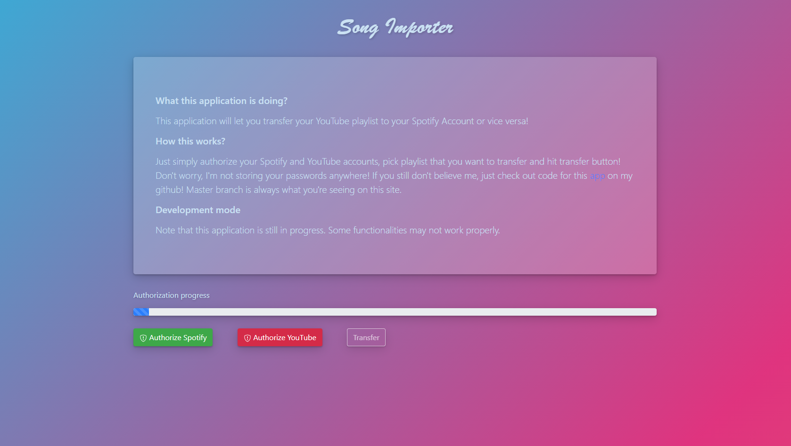

# Song Importer 
Open source web app that will help you import your playlists between Spotify and Youtube.

Check the live app [here](https://yt-song-importer.herokuapp.com/). Note that this app is working on a free heroku server, so it
can be loading for up to 15 seconds.

## Table of Contents
* [General info](#general-info)
* [Screenshots](#screenshots)
* [Technologies](#technologies)
* [Features](#features)
* [Setup](#setup)
* [Status](#status)

## General info
This app contains backend and frontend as a singleton application. For simplicity thymeleaf is only used for getting 
data from backend to frontend. 

User data such as email, account name, password or any other sensitive data are not stored anywhere.
This app only uses tokens which are stored in session. Each user is identified by sessionId cookie. 

## Screenshots


## Technologies
* Java 11
* Spring Boot - ver 2.3.3
* Google Api Client - ver 1.30.10
* Google Api Services Youtube - ver v3-rev20200618-1.30.9
* Gson - ver 2.8.6
* Thymeleaf - ver 5.3.0.11
* VueJS - newest version
* Bootstrap - ver 4.5.3

## Features
List of working features:
* Transferring playlists from Youtube to Spotify

Not implemented yet:
* Transferring playlists from Spotify to Youtube

## Setup
To run this app locally download source code:
`git clone https://github.com/Ejden/yt-song-importer`

To successfully run this application you have to provide env file. Here's the example:

````
SPOTIFY_CLIENT_ID=enter-your-spotify-api-client-id
REDIRECT_URI=http://localhost:80/auth/spotify/acceptAuthCode
SPOTIFY_CLIENT_SECRET=enter-your-spotify-api-client-secret
YOUTUBE_AUTH_KEY=enter-your-youtube-auth-key
YOUTUBE_CLIENT_ID=enter-your-youtube-api-client-id
YOUTUBE_CLIENT_SECRET=-enter-your-youtube-api-client-secret
YOUTUBE_REDIRECT_URI=http://localhost/auth/youtube/acceptAuthCode
````

## Status
Project in progress - Due to limited free time new version are released slowly